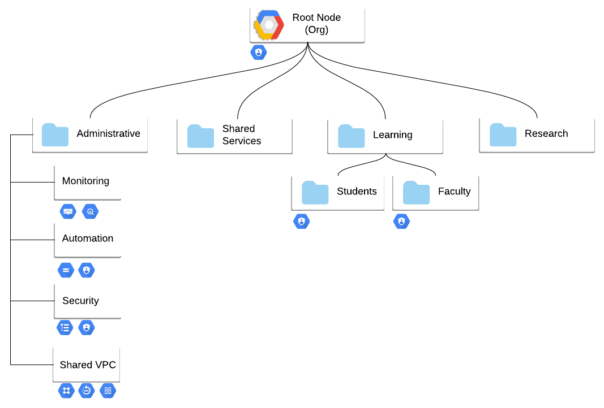

# terraform-gcp-foundation

This is an example repo showing how the Cloud Foundation Toolkit (CFT) Terraform modules can be composed to build a secure GCP foundation. The supplied structure and code is intended to form a starting point for building your own foundation with pragmatic defaults you can customize to meet your own requirements. Currently, the code leverages Google Cloud Build for deployment of the Terraform from step 1 onwards. Cloud Build has been chosen to allow teams to quickly get started without needing to deploy a CI/CD tool, although it is worth noting the code can easily be executed by your preferred tool.

## Overview



This repo creates an organization layout with two folder levels, where the first level is usually mapped to a business unit or a team (infra, data, research) and the second level can represent environments (prod,test) or a need for additional separation. It also sets up all the prerequisites for automation (GCS state bucket, service account, Cloud Build, etc) and the correct roles.

The end result will looking very similar to the diagram where our automation and security projects are grouped under one central folder, with policies being applied at the organization level with exceptions, if required.

This repo contains several distinct Terraform projects each within their own directory that must be applied separately, but in sequence. Each of these Terraform projects are to be layered on top of each other, running in the following order.

## [0. bootstrap](./0-bootstrap)


This stage bootstraps an existing GCP environment, creating all the required GCP resources and permissions to start using GCP.

The bootstrap step includes:

* The `automation` project, which contains:
    * Terraform state bucket
    * Cloud Build service account used by Terraform to create new resources in GCP
    * A CI/CD pipeline implemented with Cloud Build
    * Bind the Cloud Build service account to the billing account as `roles/billing.user`

## [1. org](./1-org)

The purpose of this stage is to set up top level folders used to house projects which contain shared resources such as monitoring, networking, org level logging and also to set baseline security settings through organizational policy. This will create the following folder & project structure:

```
abc.com
└── Administration Folder
    ├── ${domain}-infosec
    ├── ${domain}-shared-vpc
    └── ${domain}-monitoring
```

<b>Logs</b>

Under the `Administration` folder a project for logs is created. This project is used for organization wide audit logs.

<b>Monitoring</b>

Under the `Administration` folder a project for monitoring is created which is used as a Cloud Monitoring workspace for all projects in the environment. Note that creating the workspace and linking projects can currently only be completed through the Cloud Console.

<b>Networking</b>

Under the `Administration` folder a project for networking is created, which is intended to be used as a Shared VPC Host project for all projects in that environment. This stage only creates the projects and enables the correct APIs, the following networks stage creates the actual Shared VPC networks.

<b>Organization Policies</b>

Finally, this step also applies a number of baseline Organizational Policies. It is important to understand what restrictions these policies are applying within your GCP organization. Update these restrictions to meet your requirements.

## [1-org-b (optional)](./1-org-b/)

Some environments require exceptions from the initial org policies in the previous step. This `optional` step can be used to set org policies, or create service accounts, or deploy additional sub-folders.

## [1-org-c (optional)](./1-org-c/)

Manual steps that could not be automated.

## [2-networks](./2-networks/)

This step focuses on creating a Shared VPC in a standard configuration with a reasonable security baseline. Currently this includes:

* Example subnet that does not contain secondary ranges for GKE (commented out).
* Default firewall rules created to allow remote access to VMs through IAP, without needing public IPs.
    * `allow-ipa-ssh` and `allow-iap-rdp` network tags
* private.googleapis.com configured for private access to googleapis.com and gcr.io. Route added for VIP so no internet access is required to access APIs.
* Default route for internet access is created. This can be modified by editing code to delete default gateway and instead use tag based routes.
* Cloud NAT configured for all subnets with logging and static outbound IPs.
* Cloud DNS is deployed in the Shared VPC Host project following the [hybrid architecture best practice](https://cloud.google.com/dns/docs/best-practices-dns#hybrid_architecture_using_a_single_shared_vpc_network).
    * `default-policy` Cloud DNS policy applied with DNS logging and inboud query forwarding turned on to allow for inboud queries
    * An authoritative private zone (`gcp.example.com`) in the host project
    * A DNS forwarding zone that forwards to `corp.example.com` to the on-premises DNS server

## Final

```
abc.com
├── Administration Folder
    ├── automation
    ├── {domain}-infosec
    ├── {domain}-shared-vpc
    └── {domain}-monitoring
├── Academic
├── Administrative
├── Core
├── Learn
    ├── Faculty
    └── Students
├── Research
    ├── {env}-single-project
    └── {env}-standard-project
├── Sensitive
└── Shared
```

