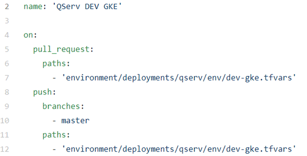
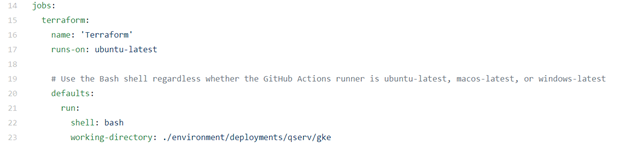
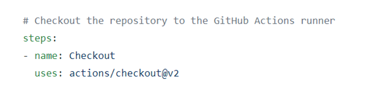
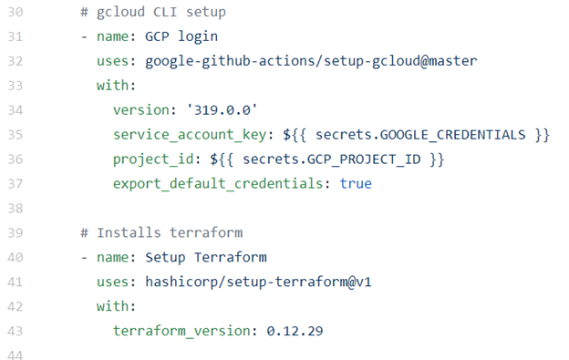
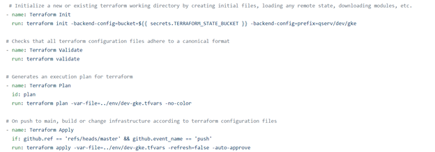
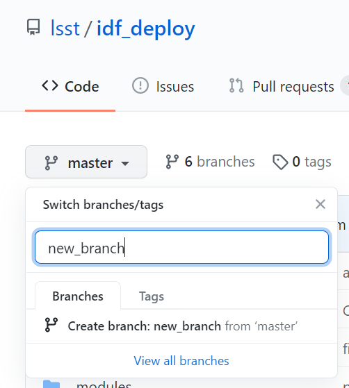

# Github Actions

A specified event automatically triggers the workflow, which contains a job. The job then uses steps to control the order in which actions are run.

# Overview
The following is an overview of a standard YAML file. 

The specified event that automatically triggers the workflow are pull requests and pushes to the main branch. Any changes to the .tfvars files will be monitored and will trigger the build process to run automatically.



A job is a collection of steps to be executed and in this case, it is configure to be Terraform. 



Your repository will then be checked out, allowing you to run actions against your code.



Authentication to GCP will take place the CLI will will be installed with Terraform.



If the push is going to the main branch, terraform fromatting checks will happen and the files will go through the init, validate, plan and apply process. 




## Example updated .tfvars file

* Create a new branch. 



*  On the newly created branch, Update the `.tfvars` file. In the below example, the fileshare capacity is being modified. 
```diff
-   fileshare_capacity = 2000
+   fileshare_capacity = 2500
```
* Commit and push the changes onto the main branch. 

* Merge the pull request from the Pull Request tab.

* View the real time logs from the Actions tab of the build process. 


