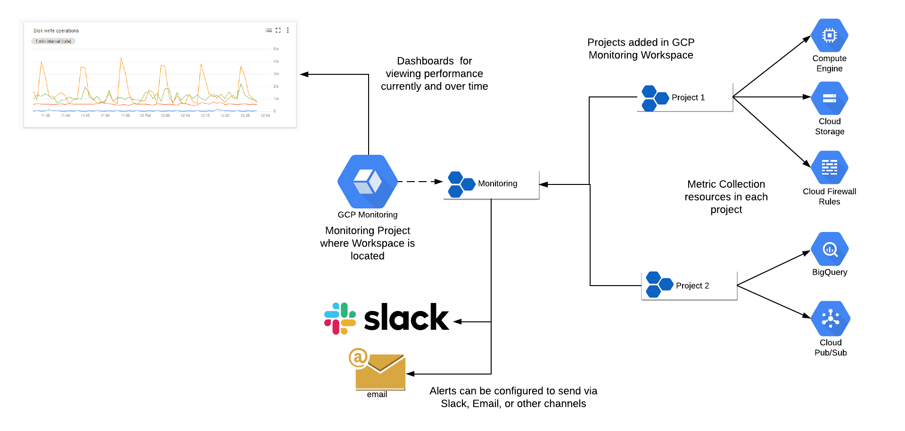

# GCP Monitoring and Logging
Google Cloud Monitoring also known as Stackdriver is the Google Cloud Built in monitoring tool.  Overview of GCP Monitoring and Logging below.  



Logs can be viewed via the GCP Logging service inside the GCP project.  Log costs are [here](https://cloud.google.com/stackdriver/pricing)

## Monitoring

A centralized GCP monitoring workspace is created in the [rubin-monitoring GCP project](https://console.cloud.google.com/monitoring?project=rubin-monitoring-1abd&timeDomain=1h). Logs and Metrics from all the RSP and QServ projects are collected.  The following dashboards are created.

* GKE - Built in Dashboard with info on all monitored GKE clusters. Broken out by Clusters, Namespaces, Nodes, Services, Deployments, and Pods
* Infrastructure Summary - Built in Dashboard showing top VMs by CPU, 
* RSP GKE - Custom Dashboard with Science Platform GKE CPU, Memory data
* RSP GKE Disk - Custom Dashboard with Science Platform GKE IO, bandwidth data on Filestore and Persistent Disks

The following roles are provisioned for access to view and configure dashboards.
* GCP Monitoring Viewer - view dashboards only
* GCP Monitoring Admins - create, edit dashboards and alerts.  Add projects to workspace

Additional examples in the subdirectores below are provided and can be imported.
* [Compute](compute)
* [Networking](networking)
* [Storage](storage)

## Monitoring Design Considerations
Below are some design considerations when using GCP monitoring.
* Monitoring specific projects as a GCP monitoring workspace to aggregate metrics from multiple projects for teams or applications.  The limit is 100 projects per workspace.
* Metrics from the API and Services page are viewable as metrics giving you historical view of API usage.  Viewing metric usage is helpful is trying to determine if code is calling GCP or successfully authenticating
* Using Labels so that resources are grouped using the Group feature in GCP Monitoring dashboards
* Anything in Stackdriver logs can be viewed as a metric.  This is useful for custom logs are seeing operational issues over time that are not exposed as GCP monitoring metrics like preemption events or GKE pod scheduling errors
* Alert thresholds are useful to monitor if something is within range.  An example is a setting a threshold for the number of files written to Cloud Storage in an hour or number of PubSub messages generated

### Monitoring Dashboards
Dashboards can be created via in the GCP monitoring console, exported and then imported as JSON with gcloud, or deployed as infrastructurea as code via Terraform or gcloud.  Charts are created from metrics. A full metrics list is [here](https://cloud.google.com/monitoring/api/metrics) Google provided dashboard samples are [here](https://github.com/GoogleCloudPlatform/monitoring-dashboard-samples/)

### Creating Dashboards via gcloud
Use the `gcloud monitoring dashboards` create command to create a dashboard. Make sure you replace the [file-name.json] in the command:

```
gcloud monitoring dashboards create --config-from-file=[file_name.json]
```

To export a dashboard use the gcloud command like to export the dashboard to a JSON file.
```
gcloud monitoring dashboards describe \
projects/$PROJECT_NUMBER/dashboards/$DASH_ID --format=json > $FILE_NAME 
```

After exporting open the exported JSON file in an editor and remove the etag / name fields. Alternatively, you can use the sed command on a Linux or MAC terminal, for example:

```
sed -i '/"name":/d' $FILE_NAME
sed -i '/"etag":/d' $FILE_NAME
```

## GKE Logging

[GKE provides system and application logs](https://cloud.google.com/stackdriver/docs/solutions/gke/using-logs).  The system logs include admin activity, data access, and events.  Application logs are collected from container STDOUT and STDERR.

The default value for GKE is system and application logs.  At the time of initial deployment QServ was generating a large amount logs.  The QServ terraform configuration was adjusted to add a cluster monitoring and logging variable.  The [section](# Setting GKE Cluster Monitoring and Logging) describes how to change the setting.

### Viewing GKE Application Logs

GKE Application Logs can be viewed from kubectl with the normal kubectl logs command, via GCP Log Explorer in the cloud console, and with Cloud Code in VS Code.  This [document](https://cloud.google.com/logging/docs/view/logs-viewer-interface) provides an overview of how to use Log Explorer.  Sample queries for GKE are[here](https://cloud.google.com/logging/docs/view/query-library-preview#kubernetes-filters)  

Logs can be viewed with the [GKE VS Cloud Code plugin](https://marketplace.visualstudio.com/items?itemName=GoogleCloudTools.cloudcode).  Below are instructions of how to naviate
* Once installed select Cloud Code - Kubernetes from the left side of Cloud Code
* Select your cluster from the Kubernetes Explorer
* Navigate to the Namespaces and select the Namespace
* Inside of the Namespace select the Deployment or Pod, Right Click, and View Logs
* Under the Right Click is also the describe command.  Under Pods Right Click provides the option for Terminal access to the Container

### Setting GKE Monitoring and Logging

GKE logging is configured at the cluster level with Terraform.  GKE logging can be set to include System and Workload (Application) Logs or System only.  These settings can be adjusted without tearing down the cluster.   Below are instructions for changing the GKE logging settings.

* Navigate to the [terraform deployments directory](../environment/deployments)
* Open either qserv or science platform. Then go into env directory.
* Modify the tfvars file.  The naming syntax is `<env>-<gke>.tfvars`.  For development clusters open dev-gke.tfvars.  For integration open int-gke.tfvars.
* Perform a pull request to a new branch to edit the gke tfvars file
* Edit the `cluster_telemetry_type` setting below. If you do not see this variable in tfvars add it both to tfvars and the GKE deployments variables.tf to add the variable.  Possible values are:
  * ENABLED - system and workload logging
  * SYSTEM_ONLY - system logs only
  * DISABLED - all system and workload logging disabled

```
cluster_telemetry_type = "SYSTEM_ONLY"
```
* Save and check in the file to GitHub.  An automated GitHub Action will now run to perform a terraform plan to check syntax and formatting of the change. The GitHub Actions for GKE end with GKE.  Example is QServ DEV GKE. Navigate to the [Actions](https://github.com/lsst/idf_deploy/actions) to watch that status.
* Once the GitHub Action worklow runs successfully approve the pull request.  The same GitHub Action will now run with terraform apply.
