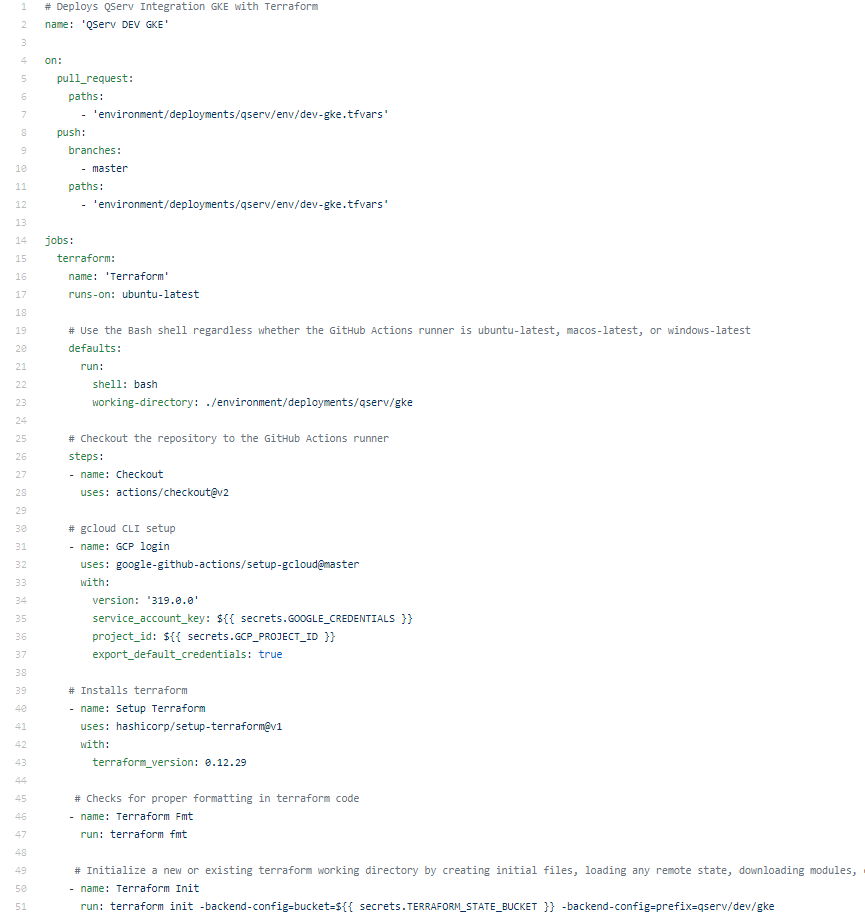
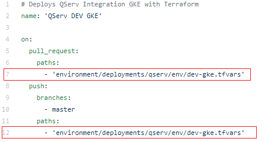
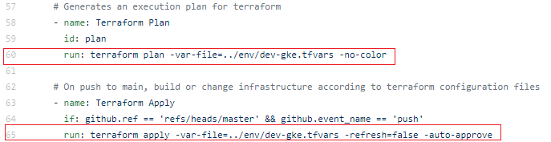

# Creating New Pipelines

**Overview**

The following demonstrates how to create a new pipeline. 

* Navigate to the [Github Actions](./runbook/github-actions.md) directory to copy the formatting for an exisiting yaml file. 

For example, using a GKE yaml file to help format a new pipeline. 

* In the new yaml file, update the  path to point to the appropriate `tfvars` file on lines 7 and 12.

* Create credentials for GCP login. 

* Update the `tfvars` path on lines 60 and 65 to reference the correct file.  

