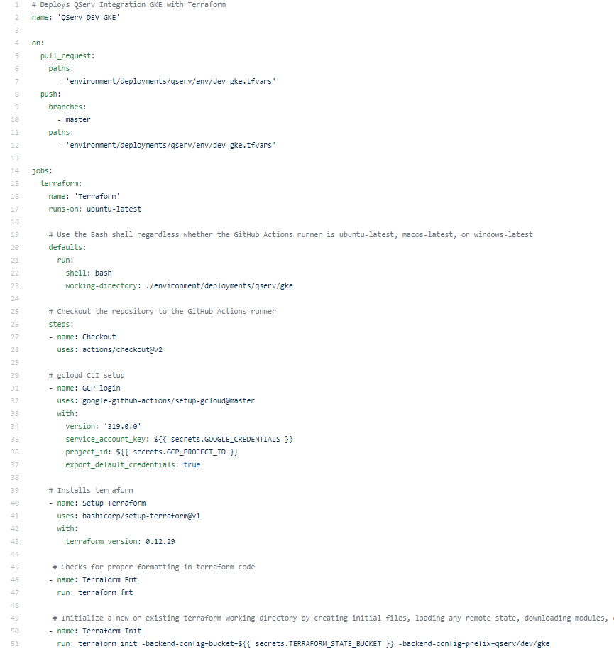
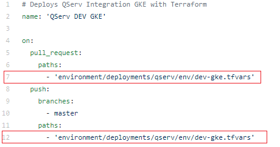
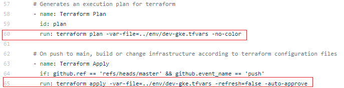

# Creating New Pipelines

**Overview**

The following demonstrates how to create a new pipeline. 

* Navigate to the [GitHub Actions](../.github/workflows) directory and copy a
  caller workflow with triggers similar to the new pipeline.

For example, using a GKE yaml file to help format a new pipeline. 

* In the new YAML file, update the trigger paths to point to the appropriate
  `tfvars` file.

* Create credentials for GCP login. 

* Configure the reusable workflow inputs: `working_directory`, `state_prefix`,
  and `tfvars_file`. Add an exceptional flag only when the deployment requires
  behavior such as applying on `workflow_dispatch` or disabling refresh.

